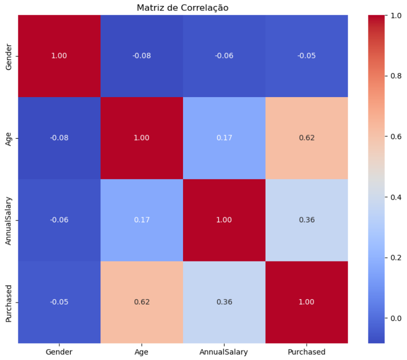
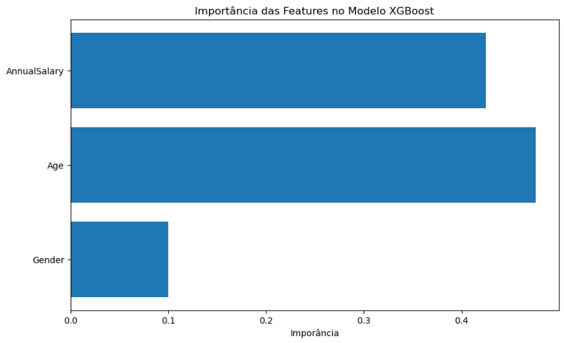

# 🚗 Predição de Compra de Carro com XGBoost

Este projeto utiliza o modelo XGBoost para prever a propensão de compra de veículos com base em dados de clientes. Foi desenvolvido como parte dos meus estudos e prática em Ciência de Dados.

## 🎯 Problema Resolvido

O modelo foi treinado para prever **se um cliente está propenso a comprar um carro ou não**, com base em suas características.  

Essa previsão ajuda empresas a:

- 🔍 Focar os esforços do time de vendas nos clientes com maior probabilidade de conversão  
- 💰 Economizar recursos com campanhas de marketing mais eficientes  
- 🤝 Oferecer ofertas personalizadas para aumentar as vendas  
- 📊 Melhorar o ROI das estratégias comerciais

## 📊 Objetivo

Aplicar o modelo XGBoost para:
- Treinar um classificador com dados reais de clientes
- Avaliar métricas de desempenho (acurácia, matriz de confusão)
- Identificar as variáveis mais influentes na decisão de compra

## 🛠️ Tecnologias Utilizadas

- Python
- Pandas
- XGBoost
- Scikit-learn
- Matplotlib / Seaborn

## 📁 Arquivos

- `projetoXgboost.ipynb`: Notebook com todo o processo de modelagem
- `CARRO_CLIENTES.csv`: Conjunto de dados utilizados

## 📸 Exemplos Visuais

---

## 📬 Contato

Projeto por [Jonathan](https://www.linkedin.com/in/jonathan-datascience/).
